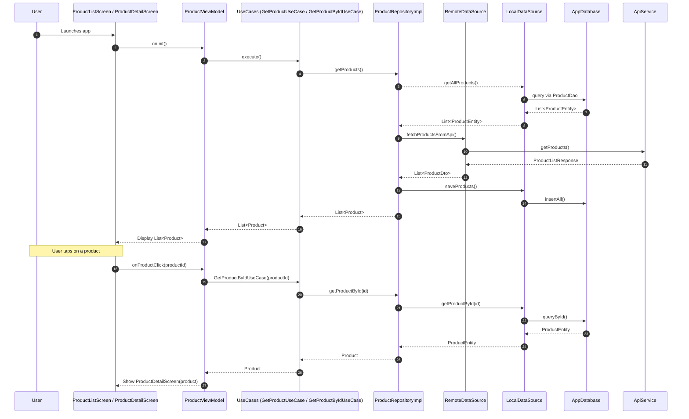

# 📱 Complete-Denver (Globe Assessment App)

A modern Android app built using **Jetpack Compose**, **MVVM**, **Clean Architecture**, and **Dependency Injection** (Hilt). This app demonstrates a product listing screen with details, following best practices in Android development.

---

## ✨ JSON DUMMY

- ✅ Api Server: https://dummyjson.com/products

## ✨ Features

- ✅ Display a list of products with name, price, rating, etc.
- ✅ View detailed information of a selected product.
- ✅ Support Offline caching via Room
- ✅ Navigation using Jetpack Navigation Compose.
- ✅ Reactive State Management using Kotlin Coroutines + Flow.
- ✅ Dependency Injection via Hilt.
- ✅ Unit tests and instrumented tests included.

---

## 🧱 Architecture

This app follows **Clean Architecture** with the following layers:

```
presentation/
│   ├── compose/               # UI Composables
│   ├── viewmodel/             # ViewModels
domain/
│   ├── model/                 # Domain Models
│   ├── usecase/               # Use Cases
│   └── util/                  # DataResult wrapper
data/
│   ├── repository/            # Repository Implementation
│   ├── remote/                # Retrofit API Service
│   └── mapper/                # DTO to Domain Model mapping
di/                            # Hilt Modules
navigation/                    # Navigation Graphs
```

✅ **SOLID Principles** applied  
✅ **Separation of Concerns** respected  
✅ Easy to **test, scale, and maintain**

---

## ✅ Tech Stack

- Kotlin
- Jetpack Compose
- Jetpack ViewModel
- Navigation Compose
- Hilt (Dagger for DI)
- Retrofit2 + OkHttp
- Coroutines + Flow
- Gson
- Room Database
- Coil
- Mockito
- JUnit + Turbine (Unit Testing)

---

## 🔧 Setup Instructions

1. Clone the repo:
   ```bash
   git clone https://github.com/MarkDenver01/globe_assessment
   cd globe_assessment
   ```

2. Open with **Android Studio Hedgehog** or newer.

3. Sync Gradle and Run the App on an emulator or device.

---

## 🧪 Running Tests

- **Unit Test**:
   ```bash
   ./gradlew testDebugUnitTest
   ```

- **Instrumented Test**:
   ```bash
   ./gradlew connectedAndroidTest
   ```

---

## 📝 Design Principles Followed

✅ MVVM (Model-View-ViewModel)  
✅ Clean Architecture  
✅ SOLID Principles  
✅ Modular and testable code  
✅ Responsive Layouts with adaptive Compose UI  
✅ State management via `StateFlow`

---

## 📱 Screens

- Product List Screen
- Product Details Screen
- (Placeholder for Favorites / Settings Graph)

---

## ✅ To Improve (Future Work)

- Implement Favorites & Settings screens
- Pagination for large product lists
- Add Filters or Sorting
- CI/CD Pipeline using GitHub Actions

---

## ✅ Project Sequence Diagram**


---------------------------------------

## ✅ Clean Architecture


